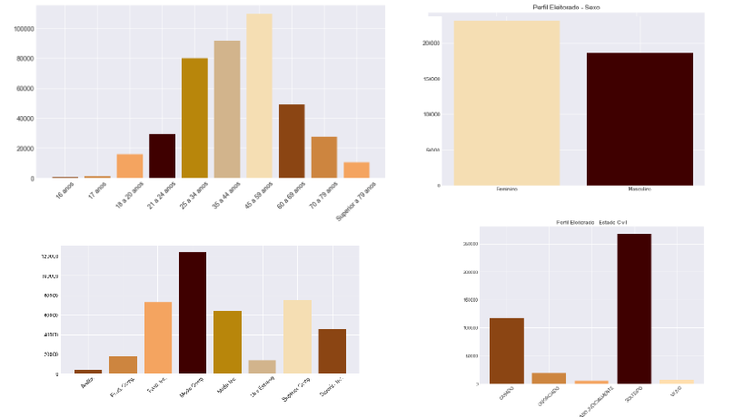
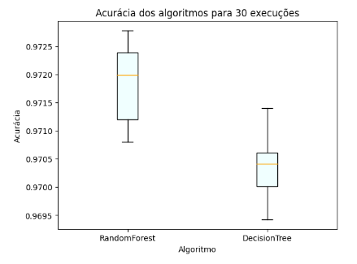

# Desafio Processo Seletivo Bazico

## O desafio consiste em responder 06 perguntas que cobrem uma ampla gama de competências, desde conhecimentos práticos de programação e análise até a capacidade de abordar problemas de negócios com um pensamento analítico.


### Questão 1 (SQL)

Considerando a tabela clientes do schema bazico e considerando que há um elemento Primary Key "cpf", a identificação de duplicatas pode ser feito:

```
SELECT * FROM bazico.clientes 
GROUP BY cpf
WHERE COUNT > 1
```

### Questão 2 (Python)

Considerando um arquivo de interesse "sales.csv" e o import das bibliotecas Numpy e Pandas.

Explicando: Utilizaria a biblioteca Pandas para primeiramente, importar o csv a partir da função 

``` bd = pandas.readcsv("sales.csv")```.

A partir dessa disposição, para facilitar o tratamento e limpeza, converteria para um Dataframe, tipo de dados do próprio Pandas. Considerando que o csv lido foi armazenado na variável bd.

```python
 df_vendas = pandas.Dataframe(bd)
```

Com isso, temos o necessário para realizar uma limpeza e tratar valores ausentes. Primeiramente, limpando os dados, é necessário que todas as colunas sigam um padrão de tipo, então procuraria, nas colunas de valor, considerando valores numéricos com casa decimal, reforçar com um:

 ```python
  df_vendas = df_vendas.apply(lambda x: float(x['valor']))
```
E analogamente para qualquer outro campo que necessite de uma validação de tipo. Caso alguma linha não possa ser convertida, vale a análise individual, caso não se encaixe a linha pode ser removida.

Para tratar dados faltantes, existem algumas maneiras. No caso de valores de texto, que não serão utilizados pra cálculos e que não tenham uma certa relevância na análise dos dados, pode ser substituita por um valor padrão, por exemplo:
Uma coluna chamada nome pode ser substituida por 'desconhecido' ou 'não informado'. Isso pode ser feito facilmente usando:

```python

df_vendas[['nome']] = df_vendas[['nome']].fillna(value="desconhecido")

```

Com tudo certo, é possível realizar análises baseadas no tipo do produto, preço, nome do cliente, etc. 

Métricas interessante que podem ser feitas é identificar por exemplo: os produtos mais vendidos e a comparação com o montante de todos os produtos, tendo assim uma participação relativa com o total. Outra é considerar as cores de camisa mais compradas, o que pode facilitar na reposição do estoque.

Além disso, com a data de compras também é possível ter uma estimativa dos dias mais lucrativos ou mais movimentados do mês na empresa, que pode ajudar na organização da logistica de entregas.

Além disso, com o armazenamento a longo prazo, é possível criar um robusto gráfico com a comparação mês a mês do valor das vendas e criar uma automação para criar um csv para salvar um resumo por mês, bimestre ou até anual.


### Questão 3 (Ferramentas de Análise)

Já utilizei: Matplotlib (90%) Seaborn (10%)


A análise abaixo foi feita no último mês em um projeto junto à LADATA e Mangue Jornalisto para analisar o eleitorado de Aracaju. Os gráficos foram gerados separadamente e juntos apenas para propósito de visualização nesse processo Seletivo



Esse segundo gráfico, ainda que mais simples, foi utilizado para analisar a eficiência de dois algoritmos, que foram utilizados para a classificação de modelos no meu projeto de Pesquisa.




### Questão 4 (Problema de Negócio com Dados)


Para esse tipo de problema, é importante saber desde quando a base de dados está sendo construida, é interessante analisar a tendencia com o passar de anos, por exemplo, para ter uma tendência em cada mês ou período, apesar disso, é possível fazer uma análise mês a mês considerando as datas mais movimentadas de compras na loja. Seja quando um anuncio novo é soltado nas redes sociais ou um grande evento, como a Black Friday ou um saldão. Considerando isso, é possivel realizar uma regressão Linear considerando a data e as vendas associadas àquela data todos os meses, ou a estimativa de numeros de venda de um produto no mês.


Uma maneira mais simples, pode ser considerar a média das vendas por mês já cadastradas e considerar a média por mês, considerando o desvio padrão como um possível erro previsto. 


### Questão 5 (Transformação de Dados)


### Questão 6 (Campanha em Salvador)


