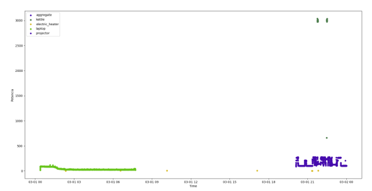

# Desafio Processo Seletivo Bazico ≠

## O desafio consiste em responder 06 perguntas que cobrem uma ampla gama de competências, desde conhecimentos práticos de programação e análise até a capacidade de abordar problemas de negócios com um pensamento analítico.

Autor: Sérgio Manhães Moura Filho
> Os códigos abaixo foram feitos fora de contexto, apenas para exemplificar, a nomeação das variáveis e tabelas foi feita por convenção minha. 

## 🏢 **Questão 1 (SQL)**

Considerando a tabela clientes do schema bazico e considerando que há um elemento Primary Key "identificador", que é um inteiro AUTO_INCREMENT e cpf sendo um campo que não pode haver duplicatas, a identificação de duplicatas pode ser feito:

```SQL
SELECT cpf, COUNT(*) FROM bazico.clientes
GROUP BY cpf
WHERE COUNT(*) > 1;

```

Para a exclusão, é necessário que pelo menos a primeira ocorrencia seja mantida, pode ser feito um subselect para encontrar o menor identificador e excluir os outros. Particularmente, não trabalhei com esse tipo de ocorrencia, mas pode ser algo do tipo:

```SQL
DELETE FROM bazico.clientes
WHERE identificador NOT IN (SELECT MIN(identificador) FROM bazico.clientes GROUP BY cpf);
```

Com isso, é possível excluir todas as duplicatas, mantendo a primeira ocorrencia.


## 🐍 **Questão 2 (Python)**

Considerando um arquivo de interesse "sales.csv" e o import das bibliotecas Numpy e Pandas.

Explicando: Utilizaria a biblioteca Pandas para primeiramente, importar o csv a partir da função 

```python
 bd = pandas.read_csv("sales.csv") 
```

A partir dessa disposição, para facilitar o tratamento e limpeza, converteria para um Dataframe, tipo de dados do próprio Pandas. Considerando que o csv lido foi armazenado na variável bd.

```python
 df_vendas = pandas.Dataframe(bd)
```

Com isso, temos o necessário para realizar uma limpeza e tratar valores ausentes. Primeiramente, limpando os dados, é necessário que todas as colunas sigam um padrão de tipo, então procuraria, nas colunas de valor, considerando valores numéricos com casa decimal, reforçar com um:

 ```python
  df_vendas = df_vendas.apply(lambda x: float(x['valor']))
```
E analogamente para qualquer outro campo que necessite de uma validação de tipo. Caso alguma linha não possa ser convertida, vale a análise individual, caso não se encaixe a linha pode ser removida.

Para tratar dados faltantes, existem algumas maneiras. No caso de valores de texto, que não serão utilizados pra cálculos e que não tenham uma certa relevância na análise dos dados, pode ser substituita por um valor padrão, por exemplo:
Uma coluna chamada nome pode ser substituida por 'desconhecido' ou 'não informado'. Isso pode ser feito facilmente usando:

```python

df_vendas[['nome']] =df_vendas[['nome']].fillna(value="desconhecido")

```

Já se tratando de números, é um pouco mais complicado, pois pode afetar diretamente a análise do que está sendo pedido, contudo, se tratando de uma base que tem informações de um produto, é possivel fazer uma associação direta do nome do produto com seu preço determinado, por exemplo:

```python

# supondo que o elemento do df_vendas tem os campos nome,preco,data

produto = {"camisa_bazica_preta":140.00}

for produto in df_vendas:
    if produto['preco'] == None:
        produto['preco'] = produto[produto['nome']]

```
Nesse caso, se o preço do produto não estiver informado, ele será substituido pelo preço associado ao nome do produto.

Outro caso é substituir por um valor padrão, que geralmente é a media dos valores da coluna, o que não é o ideal para uma análise meticulosa.

Com tudo certo, é possível realizar análises baseadas no tipo do produto, preço, nome do cliente, etc. 

Métricas interessante que podem ser feitas é identificar por exemplo: os produtos mais vendidos e a comparação com o montante de todos os produtos, tendo assim uma participação relativa com o total. Outra é considerar as cores de camisa mais compradas, o que pode facilitar na reposição do estoque.

Além disso, com a data de compras também é possível ter uma estimativa dos dias mais lucrativos ou mais movimentados do mês na empresa, que pode ajudar na organização da logistica de entregas.

Além disso, com o armazenamento a longo prazo, é possível criar um robusto gráfico com a comparação mês a mês do valor das vendas e criar uma automação para criar um csv para salvar um resumo por mês, bimestre ou até anual.


## 📊 **Questão 3 (Ferramentas de Análise)**

Já utilizei: Matplotlib (90%) Seaborn (10%)


>A análise abaixo foi feita no último mês em um projeto junto à LADATA e Mangue Jornalisto para analisar o eleitorado de Aracaju. Os gráficos foram gerados separadamente e juntos apenas para propósito de visualização nesse processo Seletivo


>Esse segundo gráfico, ainda que mais simples, foi utilizado para analisar a eficiência de dois algoritmos, que foram utilizados para a classificação de modelos no meu projeto de Pesquisa.


>Esse último gráfico está sendo utilizado em meu TCC para analisar a tendencia de potência elétrica de aparelhos de uma residência, para posteriormente gerar um modelo de previsão de consumo de energia e classificação de aparelhos.



## 🧑‍💼 **Questão 4 (Problema de Negócio com Dados)**


Para esse tipo de problema, é importante saber desde quando a base de dados está sendo construida, é interessante analisar a tendencia com o passar de anos, por exemplo, para ter uma tendência em cada mês ou período. 
Apesar disso, é possível fazer uma análise mês a mês considerando as datas e dias de semana mais movimentados da loja. Seja quando um anuncio novo é soltado nas redes sociais ou um grande evento, como a Black Friday ou um saldão. Considerando isso, é possivel realizar uma regressão Linear considerando a data e as vendas associadas àquela data todos os meses, ou a estimativa de numeros de venda de um produto ou da loja inteira no mês.

O resultado do algoritmo é uma estimativa de valores futuros considerando qualquer possivel desvio ou erro associado, que tendem a diminuir com a robustez do modelo.


Uma maneira mais simples, pode ser considerar a média das vendas por mês já cadastradas e considerar a média por mês, considerando o desvio padrão como um possível erro previsto. 


## ⌨️ **Questão 5 (Transformação de Dados)**

Os projetos que necessitei uma ETL foram mais voltados para a Graduação, principalmente nos de Machine Learning, onde era necessário juntar informações de 8 bases de dados sobre elementos arquitetônicos e realizar treinamento utilizando árvores de decisão. No processo, eu precisava juntar as informações de cada base de dados, adicionar os labels e fazer a divisão de treino e teste. No processo foi necessário ajustar alguns campos presentes em uns e não em outros e arranjar uma maneira de preencher esse dados faltantes.

Outro exemplo, dessa vez em um projeto pessoal, foi o uso de WebScrapping para coletar dados da Stardew Valley Wiki, onde foi necessário juntar diversas informações de diferentes páginas e transformar em um único arquivo csv para ser utilizado em um projeto de análise de dados, que ainda não foi finalizado, mas já há versões no Kaggle.

https://www.kaggle.com/datasets/srgiomanhes/stardew-valley-villagers-dataset


## 👕 **Questão 6 (Campanha em Salvador)**

Acompanhando a série do "Da fina ou da grossa", e os stories postados em 23/09/2024, onde foi dito que +500 camisas foram vendidas na capital Bahiana, considerando isso em um periodo de tempo de uma semana, eu arriscaria dizer que por volta de 800 camisas já foram vendidas nesse período de tempo em Salvador, levando em conta de 2 a 3 semanas de campanha e com um possível crescimento acelerado na última semana. por conta dos anúncios e da campanha de marketing.

Sendo um pouco mais específico, arricaria a proporção, por semana de: 100,200 e 500 camisas.


